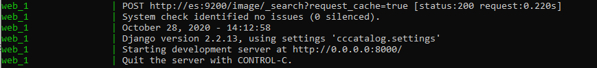
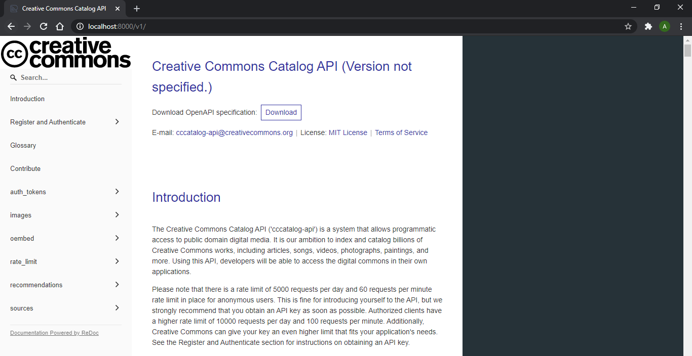
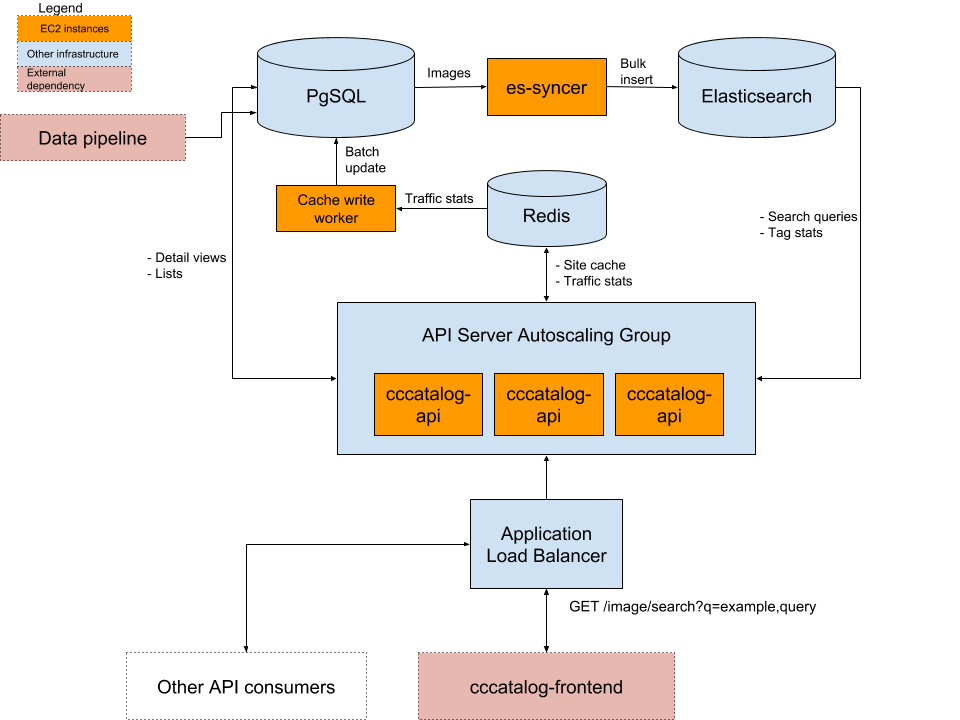

# Openverse API

## Purpose

The Openverse API (`openverse-api`) is a system that allows programmatic access to public domain digital media. It is our ambition to index and catalog [billions of openly-licensesd works](https://stateof.creativecommons.org/), including articles, songs, videos, photographs, paintings, and more. Using this API, developers will be able to access the digital commons in their own applications.

This repository is primarily concerned with back end infrastructure like datastores, servers, and APIs. The pipeline that feeds data into this system can be found in the [Openverse Catalog repository](https://github.com/WordPress/openverse-catalog). A front end web application that interfaces with the API can be found at the [Openverse frontend repository](https://github.com/WordPress/openverse-frontend).

## API Documentation

In the [API documentation](https://api.openverse.engineering), you can find more details about the endpoints with examples on how to use them.

## How to Run the Server Locally

### Prerequisites

You need to install [Docker](https://docs.docker.com/install/) (with [Docker Compose](https://docs.docker.com/compose/install/)), [Git](https://git-scm.com/downloads), and [PostgreSQL client tools](https://www.postgresql.org/download/). On Debian, the package is called `postgresql-client-common`.

### Running locally

1. Run the [Docker daemon](https://docs.docker.com/config/daemon/)
2. Open your command prompt (CMD) or terminal
3. Clone Openverse API

```
git clone https://github.com/WordPress/openverse-api.git
```

4. Change directories with `cd openverse-api`
5. Start Openverse API locally by running the docker containers

```
docker-compose up
```

6. Wait until your CMD or terminal displays that it is starting development server at `http://0.0.0.0:8000/`
   
7. Open up your browser and type `localhost:8000` in the search tab
8. Make sure you see the local API documentation
   
9. Open a new CMD or terminal and change directory to `openverse-api`
10. Still in the new CMD or terminal, load the sample data. This script requires a local postgres installation to connect to and alter our database.

```
./load_sample_data.sh
```

11. Still in the new CMD or terminal, hit the API with a request

```
curl localhost:8000/v1/images?q=honey
```

12. Make sure you see the following response from the API
    

Congratulations! You just ran the server locally.

### What Happens In the Background

After executing `docker-compose up` (in Step 5), you will be running:

- A Django API server
- Two PostgreSQL instances (one simulates the upstream data source, the other serves as the application database)
- Elasticsearch
- Redis
- A thumbnail-generating image proxy
- ingestion-server, a service for bulk ingesting and indexing search data.
- analytics, a REST API server for collecting search usage data

### Diagnosing local Elasticsearch issues

If the API server container failed to start, there's a good chance that Elasticsearch failed to start on your machine. Ensure that you have allocated enough memory to Docker applications, otherwise the container will instantly exit with an error. Also, if the logs mention "insufficient max map count", increase the number of open files allowed on your system. For most Linux machines, you can fix this by adding the following line to `/etc/sysctl.conf`:

```
vm.max_map_count=262144
```

To make this setting take effect, run:

```
sudo sysctl -p
```

## System Architecture



### Basic flow of data

Search data is ingested from upstream sources provided by the [data pipeline](https://github.com/WordPress/openverse-catalog). As of the time of writing, this includes data from Common Crawl and multiple 3rd party APIs. Once the data has been scraped and cleaned, it is transferred to the upstream database, indicating that it is ready for production use.

Every week, the latest version of the data is automatically bulk copied ("ingested") from the upstream database to the production database by the Ingestion Server. Once the data has been downloaded and indexed inside of the database, the data is indexed in Elasticsearch, at which point the new data can be served up from the Openverse Catalog API servers.

### Description of subprojects

- _openverse-api_ is a Django Rest Framework API server. For a full description of its capabilities, please see the [browsable documentation](https://api.openverse.engineering).
- _ingestion-server_ is a service for downloading and indexing search data once it has been prepared by the Openverse Catalog
- _analytics_ is a Falcon REST API for collecting usage data.

## Running the tests

### How to Run API live integration tests

You can check the health of a live deployment of the API by running the live integration tests.

1. Change directory to the `openverse-api`

```
cd openverse-api
```

#### On the host

1. Install all dependencies for Openverse API.
```
pipenv install
```

2. Run the tests in a Pipenv subshell.
```
pipenv run bash ./test/run_test.sh
```

#### Inside the container

1. Ensure that Docker containers are up. See the section above for instructions.
```
docker-compose ps
```

2. Run the tests in an interactive TTY connected to a `web` container.
```
docker-compose exec web bash ./test/run_test.sh
```

### How to Run Ingestion Server tests

You can ingest and index some dummy data using the Ingestion Server API.

1. Change directory to ingestion server

```
cd ingestion_server
```

2. Install all dependencies for Ingestion Server API

```
pipenv install
```

3. Launch a new shell session

```
pipenv shell
```

4. Run the integration tests

```
python3 test/integration_tests.py
```

## Django Admin

You can view the custom administration views at the `/admin/` endpoint.

## Contributing

Pull requests are welcome! Feel free to [join us on Slack](https://make.wordpress.org/chat/) and discuss the project with the engineers and community memebers on #openverse.

You are welcome to take any open issue in the tracker labeled [`help wanted`](https://github.com/WordPress/openverse-api/labels/help%20wanted) or [`good first issue`](https://github.com/WordPress/openverse-api/labels/good%20first%20issue); **there's no need to ask for permission in advance**. Other issues are open for contribution as well, but may be less accessible or well defined in comparison to those that are explicitly labeled.

See the [CONTRIBUTING](CONTRIBUTING.md) file for details.

## Acknowledgments

Openverse, previously known as CC Search, was concieved and built at [Creative Commons](https://creativecommons.org). We thank them for their commitment to open source and openly licensed content, with particular thanks to original team members @kgodey, @annatuma, @mathemancer, @aldenstpage, @brenoferreira, and @sclachar, along with their [community of volunteers](https://opensource.creativecommons.org/community/community-team/).
