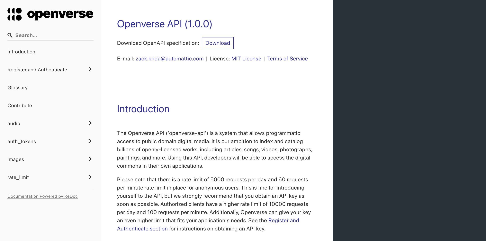
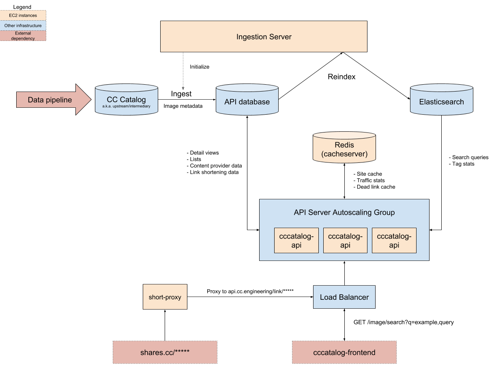

# Openverse API

## Purpose

This repository is primarily concerned with back end infrastructure like datastores, servers, and APIs. The pipeline that feeds data into this system can be found in the [Openverse Catalog repository](https://github.com/WordPress/openverse-catalog). A front end web application that interfaces with the API can be found at the [Openverse frontend repository](https://github.com/WordPress/openverse-frontend).

## Running the system

### Prerequisites

- [Git](https://git-scm.com/downloads)
- [Docker](https://docs.docker.com/install/)
- [Docker Compose](https://docs.docker.com/compose/install/)
- [Pipenv](https://pipenv.pypa.io/en/latest/#install-pipenv-today)
- [Just](https://github.com/casey/just)

### Steps

1. Ensure that the [Docker daemon](https://docs.docker.com/config/daemon/) is running.

2. Clone the repository and `cd` into it. This is the monorepo root.
   ```bash
   git clone https://github.com/WordPress/openverse-api.git
   cd openverse-api/
   ```

3. From the monorepo root, bring up the Docker Compose system. Docker Compose will automatically read the necessary environment variables from `env.docker` files from project directories.
   ```bash
   just up
   ```

4. Point your browser to `localhost:8000`. You should be able to see the API documentation.
   

5. Load the sample data. This could take a couple of minutes.
   ```bash
   just init
   ```

6. Make an API request using cURL. You should receive a JSON response.
   ```bash
   just healthcheck
   ```

   Piping the response through a pretty-printer like
   [`jq`](https://stedolan.github.io/jq/) should yield an output like the
   following.
   ```bash
   just healthcheck | jq '.[0]'
   ```

   ```json
   {
     "source_name":   "flickr",
     "display_name": "Flickr",
     "source_url": "https://www.flickr.com",
     "logo_url": null,
     "media_count": 1000
   }
   ```

7. When done, bring the system down. To remove all volumes as well, pass the `-v` flag.
   ```bash
   just down
   just down -v # removes volumes
   ```

8. Use the `logs` command access the logs from all services. To isolate a service, pass the service name as an argument.
   ```bash
   just logs
   just logs web # only shows logs web service
   ```

### Services

The command `just up` spawns the following services:

- [PostgreSQL](https://www.postgresql.org/) x 2 instances
  - upstream data source simulator
  - API application database
- [Elasticsearch](https://www.elastic.co/elasticsearch/)
- [Redis](https://redis.io/)
- [imageproxy](https://github.com/willnorris/imageproxy)
- **web** (`openverse_api/`)
- **ingestion-server** (`ingestion_server/`)
- **analytics** (`analytics/`)

The last three are subproject of this monorepo, described below.

## System architecture



### Basic flow of data

Search data is ingested from upstream sources provided by the [data pipeline](https://github.com/WordPress/openverse-catalog). As of the time of writing, this includes data from Common Crawl and multiple 3rd party APIs. Once the data has been scraped and cleaned, it is transferred to the upstream database, indicating that it is ready for production use.

Every week, the latest version of the data is automatically bulk copied ("ingested") from the upstream database to the production database by the Ingestion Server. Once the data has been downloaded and indexed inside of the database, the data is indexed in Elasticsearch, at which point the new data can be served up from the Openverse API servers.

### Description of subprojects

- **openverse_api**: a Django Rest Framework API server
  For a full description of its capabilities, please see the [browsable documentation](https://api.openverse.engineering).
- **ingestion_server**: a service for downloading and indexing search data once it has been prepared by the Openverse Catalog
- **analytics**: a Falcon REST API for collecting usage data

## Troubleshooting

### Diagnosing local Elasticsearch issues

If the API server container failed to start, there's a good chance that Elasticsearch failed to start on your machine. Ensure that you have allocated enough memory to Docker applications, otherwise the container will instantly exit with an error. Also, if the logs mention "insufficient max map count", increase the number of open files allowed on your system. For most Linux machines, you can fix this by adding the following line to `/etc/sysctl.conf`:
```ini
vm.max_map_count=262144
```

To make this setting take effect, update kernel state.
```bash
sudo sysctl -p
```

## Contributing

Pull requests are welcome! Feel free to [join us on Slack](https://make.wordpress.org/chat/) and discuss the project with the engineers and community members on #openverse.

You are welcome to take any open issue in the tracker labeled [`help wanted`](https://github.com/WordPress/openverse-api/labels/help%20wanted) or [`good first issue`](https://github.com/WordPress/openverse-api/labels/good%20first%20issue); **there's no need to ask for permission in advance**. Other issues are open for contribution as well, but may be less accessible or well-defined in comparison to those that are explicitly labeled.

See the [CONTRIBUTING](CONTRIBUTING.md) file for details.

## Acknowledgments

Openverse, previously known as CC Search, was conceived and built at [Creative Commons](https://creativecommons.org). We thank them for their commitment to open source and openly licensed content, with particular thanks to previous team members @ryanmerkley, @janetpkr, @lizadaly, @sebworks, @pa-w, @kgodey, @annatuma, @mathemancer, @aldenstpage, @brenoferreira, and @sclachar, along with their [community of volunteers](https://opensource.creativecommons.org/community/community-team/).
