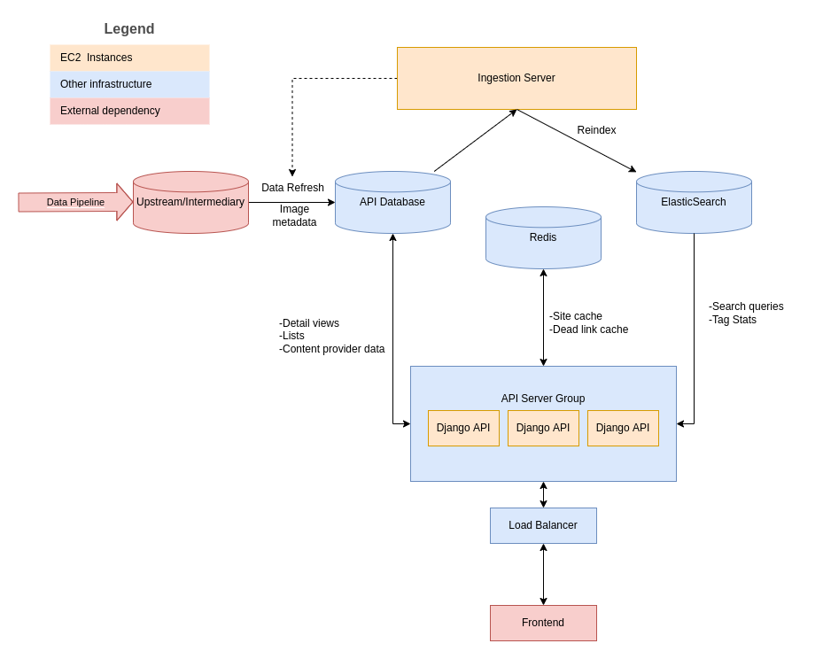

  <a href="https://github.com/orgs/WordPress/projects/3">Project Board</a> | <a href="https://make.wordpress.org/openverse/">Community Site</a> | <a href="https://make.wordpress.org/chat/">#openverse @ Slack</a> | <a href="https://make.wordpress.org/openverse/handbook/">Handbook</a> | <a href="https://www.figma.com/file/w60dl1XPUvSaRncv1Utmnb/Openverse-Releases">Figma Mockups</a>  | <a href="https://www.figma.com/file/GIIQ4sDbaToCfFQyKMvzr8/Openverse-Design-Library">Figma Design Library</a>

# Openverse API

## Purpose

This repository is primarily concerned with back end infrastructure like datastores, servers, and APIs. The pipeline that feeds data into this system can be found in the [Openverse Catalog repository](https://github.com/WordPress/openverse-catalog). A front end web application that interfaces with the API can be found at the [Openverse frontend repository](https://github.com/WordPress/openverse-frontend).

## Getting started

Our quickstart guide and other documentation can be found in our [developer docs](https://wordpress.github.io/openverse-api/guides/quickstart.html) (or within the repo at [`./api/docs/guides/quickstart.md`](./api/docs/guides/quickstart.md)).
Our API documentation can also be found at [https://api.openverse.engineering](https://api.openverse.engineering).

## System architecture

### Basic flow of data

Search data is ingested from upstream sources provided by the [data pipeline](https://github.com/WordPress/openverse-catalog). As of the time of writing, this includes data from Common Crawl and multiple 3rd party APIs. Once the data has been scraped and cleaned, it is transferred to the upstream database, indicating that it is ready for production use.

Every week, the latest version of the data is automatically bulk copied ("ingested") from the upstream database to the production database by the Ingestion Server. Once the data has been downloaded and indexed inside of the database, the data is indexed in Elasticsearch, at which point the new data can be served up from the Openverse API servers.

### Description of subprojects

- **api/**: a Django Rest Framework API server
  For a full description of its capabilities, please see the [browsable documentation](https://api.openverse.engineering).
- **ingestion_server/**: a service for downloading and indexing search data once it has been prepared by the Openverse Catalog

## Contributing

Pull requests are welcome! Feel free to [join us on Slack](https://make.wordpress.org/chat/) and discuss the project with the engineers and community members on #openverse.

You are welcome to take any open issue in the tracker labeled [`help wanted`](https://github.com/WordPress/openverse-api/labels/help%20wanted) or [`good first issue`](https://github.com/WordPress/openverse-api/labels/good%20first%20issue); **there's no need to ask for permission in advance**. Other issues are open for contribution as well, but may be less accessible or well-defined in comparison to those that are explicitly labeled.

See the [CONTRIBUTING](CONTRIBUTING.md) file for details.

## Acknowledgments

Openverse, previously known as CC Search, was conceived and built at [Creative Commons](https://creativecommons.org). We thank them for their commitment to open source and openly licensed content, with particular thanks to previous team members @ryanmerkley, @janetpkr, @lizadaly, @sebworks, @pa-w, @kgodey, @annatuma, @mathemancer, @aldenstpage, @brenoferreira, and @sclachar, along with their [community of volunteers](https://opensource.creativecommons.org/community/community-team/).
