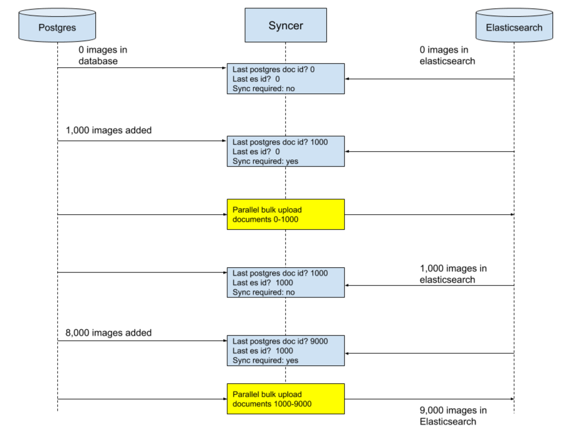

# Ingestion server

## Introduction

Ingestion Server is a small private API for copying data from an upstream source and loading it into the Openverse API. This is a two-step process:

1. The data is copied from the upstream CC Catalog database and into the downstream API database.
2. Data from the downstream API database gets indexed in Elasticsearch.

Performance is dependent on the size of the target Elasticsearch cluster, database throughput, and bandwidth available to the ingestion server. The primary bottleneck is indexing to Elasticsearch.

## How indexing works



## Safety and security considerations

The server has been designed to fail gracefully in the event of network interruptions, full disks, etc. If a task fails to complete successfully, the whole process is rolled back with zero impact to production.

The server is designed to be run in a private network only. You must not expose the private Ingestion Server API to the public internet.

## Running on the host

1. Create environment variables from the template file.
   ```bash
   just env
   ```

2. Install Python dependencies.
   ```bash
   just install
   ```

3. Start the Gunicorn server.
   ```bash
   pipenv run gunicorn
   ```

## Running the tests

<!-- TODO -->

#### Making requests

To make cURL requests to the server
```bash
pipenv run \
  curl \
    --XPOST localhost:8001/task \
    -H "Content-Type: application/json" \
    -d '{"model": <model>, "action": <action>}'
```

Replace `<model>` and `<action>` with the correct values. For example, to
download and index all new images, `<model>` will be `"image"` and `<action>`
will be `"INGEST_UPSTREAM"`.

## Configuration

All configuration is performed through environment variables. See the `env.template` file for a comprehensive list of all environment variables. The ones with sane defaults have been commented out.

Pipenv will automatically load `.env` files when running commands with `pipenv run`.

## Mapping database tables to Elasticsearch

In order to synchronize a given table to Elasticsearch, the following requirements must be met:

- The database table must have an autoincrementing integer primary key named `id`.
- A SyncableDoctype must be defined in `es_syncer/elasticsearch_models`. The SyncableDoctype must implement the function `database_row_to_elasticsearch_model`.
- The table name must be mapped to the corresponding Elasticsearch SyncableDoctype in `database_table_to_elasticsearch_model` map.

Example from `es_syncer/elasticsearch_models.py`:

```python
class Image(SyncableDocType):
    title = Text(analyzer="english")
    identifier = Text(index="not_analyzed")
    creator = Text()
    creator_url = Text(index="not_analyzed")
    tags = Text(multi=True)
    created_on = Date()
    url = Text(index="not_analyzed")
    thumbnail = Text(index="not_analyzed")
    provider = Text(index="not_analyzed")
    source = Text(index="not_analyzed")
    license = Text(index="not_analyzed")
    license_version = Text("not_analyzed")
    foreign_landing_url = Text(index="not_analyzed")
    meta_data = Nested()

    class Meta:
        index = 'image'

    @staticmethod
    def database_row_to_elasticsearch_doc(row, schema):
        return Image(
            pg_id=row[schema['id']],
            title=row[schema['title']],
            identifier=row[schema['identifier']],
            creator=row[schema['creator']],
            creator_url=row[schema['creator_url']],
            tags=row[schema['tags_list']],
            created_on=row[schema['created_on']],
            url=row[schema['url']],
            thumbnail=row[schema['thumbnail']],
            provider=row[schema['provider']],
            source=row[schema['source']],
            license=row[schema['license']],
            license_version=row[schema['license_version']],
            foreign_landing_url=row[schema['foreign_landing_url']],
            meta_data=row[schema['meta_data']],
        )


# Table name -> Elasticsearch model
database_table_to_elasticsearch_model = {
    'image': Image
}
```

## Deployment (last deployed version: 1.20.0)

This codebase is deployed as Docker image to Docker hub. The deployed image is then pulled in the production environment. See the [`./publish_release.sh`](publish_release.sh) script for deploying to Docker hub. The machine running the script must be logged into Docker as the Openverse account.

The current Docker hub image is at [openverse/ingestion_server](https://hub.docker.com/r/openverse/ingestion_server) but the image previously lived at [creativecommons/ingestion_server](https://hub.docker.com/r/creativecommons/ingestion_server).

The version numbering for the Docker image appears to be a standalone semver value, separate from the repository version.
