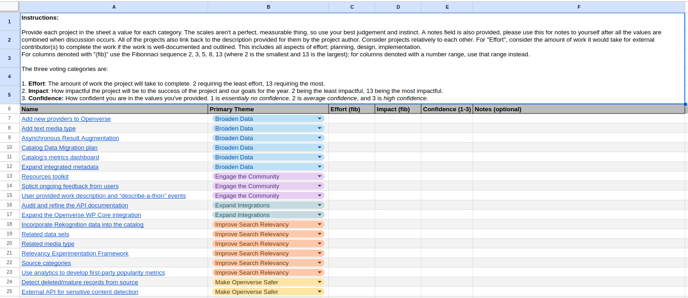
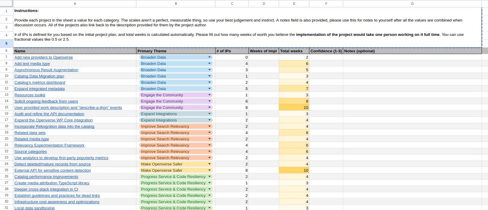
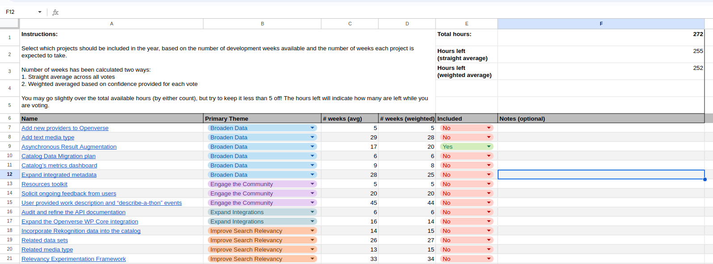

# Project Planning Utilities

This directory contains utilities for project planning. See the below
descriptions for each script.

## Graph Project Voting

The Openverse maintainers have historically prioritized projects for the next
year by creating a list of projects and then voting on their effort and impact.
Instructions provided to maintainers are as follows:

> **Instructions**:
>
> Provide each project in the sheet a value for each category. The scales aren't
> a perfect, measurable thing, so use your best judgement and instinct. A notes
> field is also provided, please use this for notes to yourself after all the
> values are combined when discussion occurs. All of the projects also link back
> to the description provided for them by the project author. Consider projects
> relatively to each other. For "Effort", consider the amount of work it would
> take for external contributor(s) to complete the work if the work is
> well-documented and outlined. This includes all aspects of effort: planning,
> design, implementation. For columns denoted with "(fib)" use the Fibonacci
> sequence 2, 3, 5, 8, 13 (where 2 is the smallest and 13 is the largest); for
> columns denoted with a number range, use that range instead.
>
> The three voting categories are:
>
> 1. **Effort**: The amount of work the project will take to complete. 2
>    requiring the least effort, 13 requiring the > most.
> 2. **Impact**: How impactful the project will be to the success of the project
>    and our goals for the year. 2 being the least impactful, 13 being the most
>    impactful.
> 3. **Confidence**: How confident you are in the values you've provided. 1 is
>    essentially no confidence, 2 is average confidence, and 3 is high
>    confidence.

This script is used to ingest the output of the voting and produce box plots for
effort and impact respectively, with each box colored by the average confidence
for that project.

The input file is an Excel spreadsheet which looks like the following:

The input file should have one "sheet" per voter, with each sheet's title being
the member's name. Each sheet should be a copy of the first sheet, named
"Template", which has all the same columns/information but with the votes filled
in.

The output is two box plots, one for effort and one for impact, which look like
the following:

## Average Weeks of Work Calculation

In addition to voting on effort and impact, maintainers also vote on the number
of weeks a prospective project might take. Instructions provided to the
maintainers are as follows:

> **Instructions**:
>
> Provide each project in the sheet a value for each category. The scales >
> aren't a perfect, measurable thing, so use your best judgement and > instinct.
> A notes field is also provided, please use this for notes to > yourself after
> all the values are combined when discussion occurs. All of the projects also
> link back to the description provided for them by the project author.
>
> \# of IPs is defined for you based on the initial project plan, and total
> weeks is calculated automatically. Please fill out how many weeks of worth you
> believe the implementation of the project would take one person working on it
> full time. You can use fractional values like 0.5 or 2.5.

The script is used to ingest the output of the voting and produce two CSV files
for average weeks and weighted average weeks. The weighted average weeks uses
the confidence value as the weight for the average (although some special
considerations had to be made when performing the actual calculation because not
all projects had votes in all 3 confidence levels).

The input file is an Excel spreadsheet which looks like the following:

The output CSVs will have two columns: the project name and the computed weeks.

## Project Selection

As the last step in project planning, using data compiled from the above steps,
maintainers vote on which projects they believe should be included in the next
year. The weeks of work estimation and total weeks of work are both used to
calculate how many projects can be selected when the maintainers are voting.
Instructions provided to the maintainers are as follows:

> **Instructions**:
>
> Select which projects should be included in the year, based on the number of
> development weeks available and the number of weeks each project is expected
> to take.
>
> Number of weeks has been calculated two ways:
>
> 1. Straight average across all votes
> 2. Weighted averaged based on confidence provided for each vote
>
> You may go slightly over the total available hours (by either count), but try
> to keep it less than 5 off! The hours left will indicate how many are left
> while you are voting.

This final script takes all the selection votes and groups them into 4
categories:

- Projects everyone voted for
- Projects most voted for
- Projects only some voted for
- Projects one or none voted for

The input file is an Excel spreadsheet which looks like the following:

